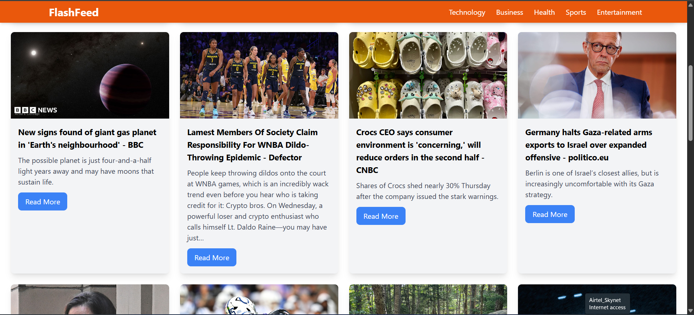

# FlashFeed

FlashFeed is a responsive news feed web app built with **React** and **Tailwind CSS**.  
It allows users to browse articles by category with a mobile-friendly **hamburger menu**.

**🔗 Live Demo:** [View Project Here](https://flash-feed-news-website-one.vercel.app/)  
**🛠 API Used:** [GNews API](https://gnews.io/)

## 🚀 Features

- **Responsive Navbar** with mobile hamburger menu
- **Category selection** (Technology, Business, Health, Sports, Entertainment)
- **Dynamic content rendering** based on selected category
- Built with **React Hooks** (`useState`)
- Styled with **Tailwind CSS**

## 📂 Project Structure

src/
├── components/
│ └── Navbar.jsx # Responsive navigation bar with hamburger menu
├── App.jsx # Main application logic
├── index.js # React entry point
└── styles.css # Tailwind base styles (if applicable)

## 🛠️ Installation & Setup

1. **Clone the repository**

````bash
git clone https://github.com/yourusername/flashfeed.git
cd flashfeed
        ```

2. **Install dependencies**

```bash
npm install
        ```

3. **Run development server**
```bash
npm run dev
        ```

## 📖 Usage

- Click on a category in the navbar to load relevant news.
- On mobile devices, tap the hamburger menu to reveal categories.
- Categories automatically close the menu when clicked.

## 🎨 Technologies Used

- **React** – Frontend framework
- **Tailwind CSS** – Utility-first CSS framework
- **JavaScript** (ES6+) – Application logic

## 📱 Responsive Design

- **Desktop:** Categories are displayed horizontally in the navbar
- **Mobile:** Categories appear in a slide-down hamburger menu

## 🖼️ Screenshot




